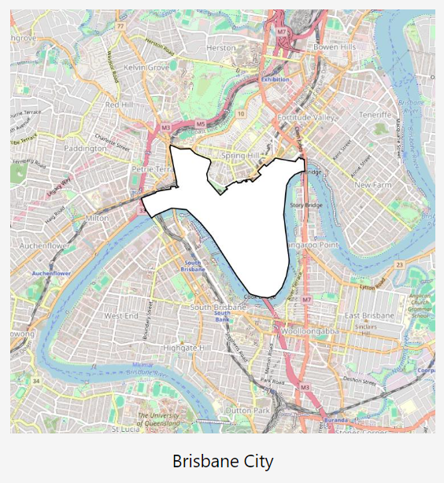

# Brisbane Suburbs Anki Deck



## Introduction

I've lived in Brisbane my whole life, and I don't know all the suburbs. That's because there are 190 of them. Anki cards are a good strategy for remember a whole lot of useless information, so I figured I'd automate the creation of a desk of Anki cards for each locality (informally known as suburbs) in Brisbane, in an attempt to remember them.

## Creating the Deck

```bash
# Install the repo
pip install -e.

# Create the deck
create-deck
```

## Where did you get the data?

Well the `locality_boundaries.kmz` file in this repo was downloaded from [here](https://qldspatial.information.qld.gov.au/catalogue/custom/detail.page?fid={8F24D271-EE3B-491C-915C-E7DD617F95DC}), and selecting the `kmz` option. I unzipped this and extracted the `kml` file which is what I use in the code.